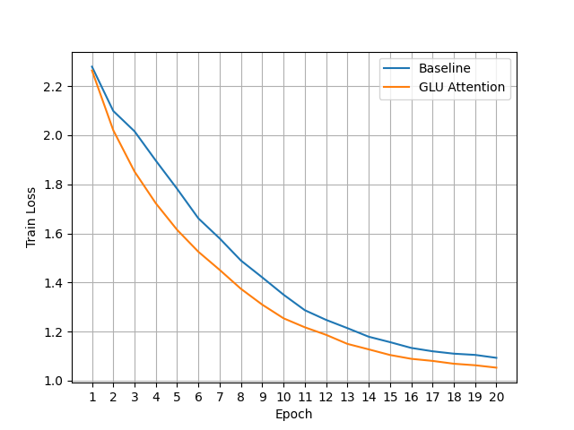
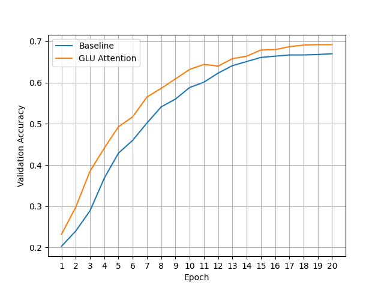
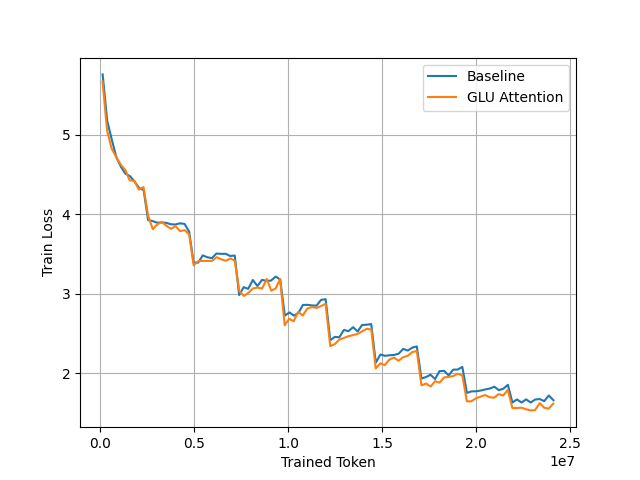
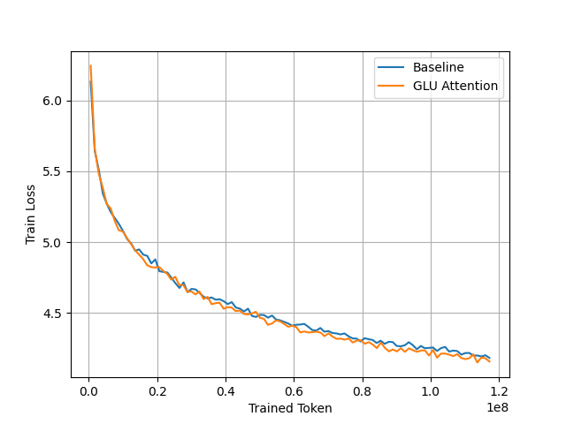

GLU Attention创新的把GLU机制引入Attention之中，增强了Transformer的模型性能和收敛速度，无额外参数开销，微乎其微的额外计算开销。对原始Attention的改动极小，并且可无缝适配多种Attention变体，大家可以快速应用到自己的Transformer项目之中，免费提升性能。希望大家都能用起来😃

GLU Attention provide nearly cost-free performance boost for transformers with a simple mechanism that applies Gated Linear Unit to the values in Attention.

# Multi-Head Attention:
$$q=W_q(q)$$
$$k=W_k(k)$$
$$v=W_v(v)$$
$$o=W_o(MHA(q,k,v))$$

# GLU Multi-Head Attention
$$q=W_q(q)$$
$$k=W_k(k)$$
$$v=W_v(v)$$
$$v1,v2=split(v,dim=-1)$$
$$v=v1*silu(v2)$$
$$o=W_o(MHA(q,k,v))$$

By this simple modification both training efficiency and model performance is boosted.

Cifar-10 training loss of each epoch. The lower the better.

Cifar-10 validation accuracy of each epoch. The higher the better.

wikitext2 training loss. The lower the better.

wikitext103 training loss. The lower the better.

