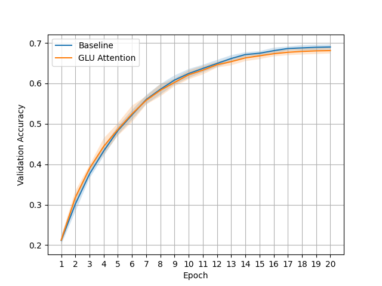

GLU Attention provide nearly cost-free performance boost for Transformer Language Models pre-training with a simple mechanism that applies Gated Linear Unit to the values in Attention.

# Multi-Head Attention:
$$q=W_q(q)$$
$$k=W_k(k)$$
$$v=W_v(v)$$
$$o=MHA(q,k,v)$$
$$o=W_o(o)$$

# GLU Multi-Head Attention
$$q=W_q(q)$$
$$k=W_k(k)$$
$$v=W_v(v)$$
$$v1,v2=split(v,dim=-1)$$
$$v=v1*silu(v2)$$
$$o=MHA(q,k,v)$$
$$o=W_o(o)$$

---

wikitext2 training loss for 10 epochs. The lower the better.

---

wikitext103 training loss for 1 epoch. The lower the better.

---

Cifar-10 training loss of each epoch. The lower the better.

---

Cifar-10 validation accuracy of each epoch. The higher the better.

